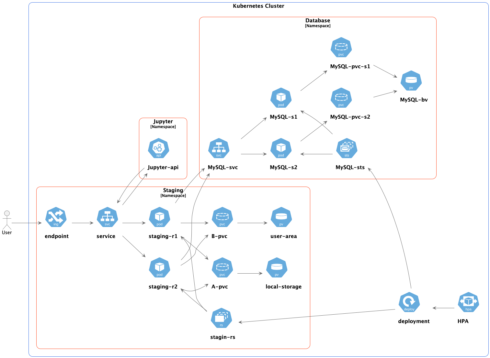

.. _Helm Deployment:

Helm Deployment
-----
The SKAO Staging Service is deployed using Kubernetes and Helm,
leveraging a modular architecture to manage data staging operations efficiently.
This Helm chart is designed to deploy the service along with all necessary resources,
including API endpoints, persistent storage, database backends, and integrations with JupyterHub.

Below is a detailed explanation of the deployment and the rationale behind the various Kubernetes
components and configurations. Also an image shows the components after a succesfull deployment.

1. Deployment
    The Deployment resource manages the pods for the SKAO Staging Service, ensuring high availability and scalability.

    - Replica Count:
        Defined in the replicaCount value, this is set to 2 by default to ensure fault tolerance and load balancing.
    - Environment Variables:
        Several environment variables are passed to the pods to configure runtime behavior, such as:

        - ALLOWED_METHODS:
            Specifies supported staging methods (local_copy, local_symlink, etc.).
        - SOURCE_STORAGE_PATH and TARGET_STORAGE_PATH:
            Define the paths for source and target storage, dynamically configured based on the type of storage (local, NFS, or Ceph).
        - LOGGING_LEVEL:
            Sets the logging verbosity level.
    - Volume Mounts:
        Mounts for storage are configured to allow seamless access to the source and user area storage.
2. Service
    The Service resource provides network access to the pods.

    - Service Type:
        Set to NodePort by default, exposing the service on a specific port to external traffic.
         - Port: Configured to listen on port 8000, which is used by the SKAO Staging Service API.
3. Ingress
    The Ingress resource routes external HTTP requests to the service.

    - Ingress Rules:
        Hosts and paths are defined to route traffic to the staging API (/stage_data), frontend (/) and logs endpoint (/logs).
        Annotations configure NGINX to handle path rewriting.
    - TLS:
        Optional TLS configuration can be added to secure communication via HTTPS.
4. Persistent Storage
    The Helm chart supports multiple storage backends for source data and user areas.

    - Local Storage:
        Default storage type, where hostPath is used to mount directories from the host machine into the pods.
    - NFS Storage:
        Enables sharing data across multiple pods via a networked file system.
    - Ceph Storage:
        For scalable, distributed storage solutions, Ceph can be used with custom options (e.g., authentication secrets).
5. JupyterHub Integration
    The deployment integrates with a JupyterHub instance, allowing data to be staged directly into a user's working directory.

    - JupyterHub URL:
        Configured via JUPYTERHUB_URL, the service interacts with the JupyterHub API to query user information, start/stop servers, and stage files.
    - Token-Based Authentication:
        A token is preconfigured to enable secure communication with JupyterHub or provided as custom query parameter to the staging API.
6. Database
    The MySQL database backend is deployed to store metadata about data staging operations.

    - MySQL Deployment:
        A dedicated Deployment manages the MySQL pods, ensuring availability and scalability.
    - Persistent Volumes:
        PersistentVolumeClaims (PVCs) and PersistentVolumes (PVs) are created for durable storage of database data, ensuring that data persists across pod restarts.
    - Secret Configuration:
        Database credentials (e.g., username, password) are securely stored as Kubernetes Secrets and injected into the deployment.
7. Horizontal Pod Autoscaler (HPA)
    An HPA is configured to automatically scale the SKAO Staging Service deployment based on CPU or memory usage, ensuring efficient resource utilization.
    staging_service is managed through a ReplicaSet, while mysql through a StatefulSet to ensure database consistency.

Below is a detailed description of the configurable variables in the `values.yaml` file for the SKAO Staging Service Helm deployment. These variables allow customization of the deployment to suit specific requirements.

Key Configuration Variables
********

.. list-table::
   :header-rows: 1

   * - **Key**
     - **Type**
     - **Default**
     - **Description**
   * - `replicaCount`
     - int
     - `2`
     - Number of replicas to deploy for the service.
   * - `image.repository`
     - string
     - `"skao-staging-service"`
     - Name of the container image repository.
   * - `image.tag`
     - string
     - `"latest"`
     - Tag of the container image to use.
   * - `image.pullPolicy`
     - string
     - `"IfNotPresent"`
     - Image pull policy, determining when Kubernetes pulls the image.
   * - `service.type`
     - string
     - `"NodePort"`
     - Type of Kubernetes service to expose (e.g., `ClusterIP`, `NodePort`, `LoadBalancer`).
   * - `service.port`
     - int
     - `8000`
     - Port on which the service will be accessible.
   * - `ingress.enabled`
     - bool
     - `true`
     - Enables or disables the ingress resource.
   * - `ingress.annotations."nginx.ingress.kubernetes.io/rewrite-target"`
     - string
     - `"/"`
     - Rewrite target for the NGINX ingress controller.
   * - `ingress.hosts[0].host`
     - string
     - `"staging-service.local"`
     - Hostname for the ingress resource.
   * - `ingress.hosts[0].paths[0].path`
     - string
     - `"/"`
     - Path for accessing the service.
   * - `ingress.hosts[0].paths[0].pathType`
     - string
     - `"ImplementationSpecific"`
     - Path type for routing traffic.
   * - `ingress.hosts[0].paths[1].path`
     - string
     - `"/logs"`
     - Path for accessing the service logs.
   * - `ingress.hosts[0].paths[1].pathType`
     - string
     - `"ImplementationSpecific"`
     - Path type for accessing logs.
   * - `ingress.tls`
     - list
     - `[]`
     - List of TLS certificates for securing ingress traffic.
   * - `logging.level`
     - string
     - `"DEBUG"`
     - Logging verbosity level.
   * - `storage.source.type`
     - string
     - `"local"`
     - Type of source storage (`local`, `nfs`, or `ceph`).
   * - `storage.source.local.enabled`
     - bool
     - `true`
     - Whether to enable local source storage.
   * - `storage.source.local.path`
     - string
     - `"/mnt/storage_a"`
     - Path to mount local source storage inside the container.
   * - `storage.source.local.hostPath`
     - string
     - `"/Volumes/FastStorage/storage_a"`
     - Path on the host machine for local source storage.
   * - `storage.source.nfs.enabled`
     - bool
     - `false`
     - Whether to enable NFS-based source storage.
   * - `storage.source.nfs.path`
     - string
     - `"/mnt/source-nfs"`
     - Path to mount NFS source storage inside the container.
   * - `storage.source.nfs.server`
     - string
     - `"nfs-source.example.com"`
     - NFS server hostname for source storage.
   * - `storage.source.nfs.serverPath`
     - string
     - `"/source-nfs-exported-path"`
     - NFS server path for source storage.
   * - `storage.source.ceph.enabled`
     - bool
     - `false`
     - Whether to enable Ceph-based source storage.
   * - `storage.source.ceph.path`
     - string
     - `"/mnt/source-ceph"`
     - Path to mount Ceph source storage inside the container.
   * - `storage.source.ceph.server`
     - string
     - `"ceph-source.example.com"`
     - Ceph server hostname for source storage.
   * - `storage.source.ceph.options`
     - string
     - `"name=admin,secret=<secret>,rw"`
     - Configuration options for connecting to Ceph source storage.
   * - `storage.userArea.type`
     - string
     - `"local"`
     - Type of user area storage (`local`, `nfs`, or `ceph`).
   * - `storage.userArea.local.enabled`
     - bool
     - `true`
     - Whether to enable local user area storage.
   * - `storage.userArea.local.path`
     - string
     - `"/mnt/user_areas"`
     - Path to mount local user area storage inside the container.
   * - `storage.userArea.local.hostPath`
     - string
     - `"/Volumes/FastStorage/user_areas"`
     - Path on the host machine for local user area storage.
   * - `storage.userArea.nfs.enabled`
     - bool
     - `false`
     - Whether to enable NFS-based user area storage.
   * - `storage.userArea.nfs.path`
     - string
     - `"/mnt/user-area-nfs"`
     - Path to mount NFS user area storage inside the container.
   * - `storage.userArea.nfs.server`
     - string
     - `"nfs-user-area.example.com"`
     - NFS server hostname for user area storage.
   * - `storage.userArea.nfs.serverPath`
     - string
     - `"/user-area-nfs-exported-path"`
     - NFS server path for user area storage.
   * - `storage.userArea.ceph.enabled`
     - bool
     - `false`
     - Whether to enable Ceph-based user area storage.
   * - `storage.userArea.ceph.path`
     - string
     - `"/mnt/user-area-ceph"`
     - Path to mount Ceph user area storage inside the container.
   * - `storage.userArea.ceph.server`
     - string
     - `"ceph-user-area.example.com"`
     - Ceph server hostname for user area storage.
   * - `storage.userArea.ceph.options`
     - string
     - `"name=admin,secret=<secret>,rw"`
     - Configuration options for connecting to Ceph user area storage.
   * - `config.allowedMethods`
     - list
     - `["local_copy", "local_symlink", "direct_download", "jupyter_copy"]`
     - Allowed data staging methods:
       - `local_copy`: Copy between two locally mounted POSIX filesystems.
       - `local_symlink`: Create symlinks between two locally mounted POSIX filesystems.
       - `direct_download`: Serve files directly from the source storage.
       - `jupyter_copy`: Copy data between the source storage and the user's JupyterHub workspace.
   * - `config.jupyterHubUrl`
     - string
     - `"https://jupyterhub"`
     - URL of the JupyterHub server.
   * - `config.rucioBaseUrl`
     - string
     - `"https://rucio-instance"`
     - Base URL for the Rucio data management system.

---

This configuration file provides flexibility in defining the deployment specifics for
the SKAO Staging Service, ensuring compatibility with different Kubernetes environments.
