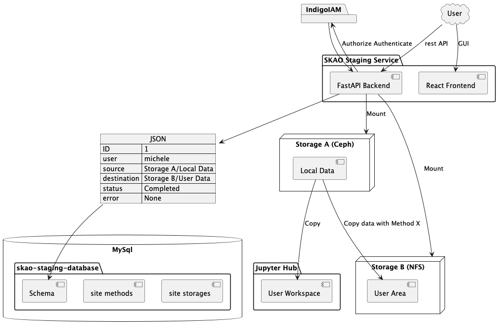
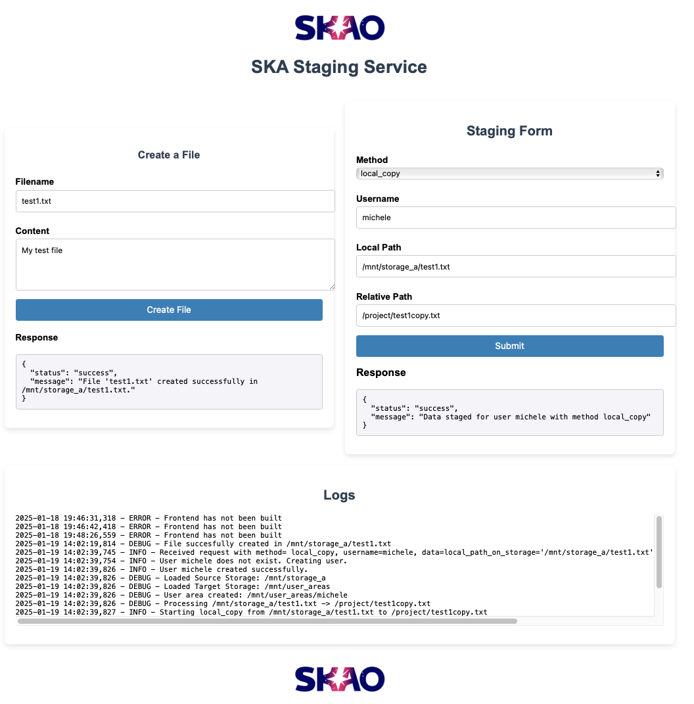
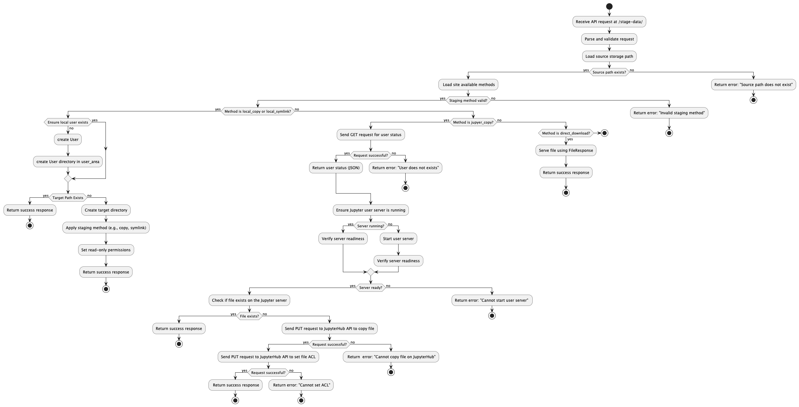

Skao Staging Service Documentation
==================================

*"To Boldly go where no staging service has gone before*

*MDV 20/01/25 - 2 AM "*

------

Welcome to the skao-staging-service documentation.
This service stages data for SKAO analysis.
The service code is distributed through GitHUb and available at the following
`Link <https://github.com/MicheleDelliVeneri/skao-staging-service>`_

Below are the main components and features of the repository:

- **FastAPI code**: Located in ``app/staging_service.py``
- **Staing Methods code**: Located in ``app/staging_methods.py``
- **Tests**: Available in ``tests/test_staging_service.py``
- **Docker configuration**: Defined in ``Dockerfile``
- **Helm chart**: Found in ``charts/my-staging-service/``
- **React frontend**: Located in ``frontend/``
- **Sphinx docs**: In ``docs/``

The service is installed and configured with Helm and runs on a kubernates clusters.
The main objective of the service is to expose an API to perform
data transfers between locally mounted storages, a mounted storage
and an user Jupyter server, or through direct download.
The documentation is structured as follows:
    - :ref:`Overview`:
        gives an overview of the service at its components;
    - :ref:`Assumptions and Simplifications for the Demo`:
        outlines the assumptions and semplifications made for the working demo of the service
    - :ref:`Helm Deployment`:
        provides an overview of the Kubernetes components deployed using Helm and lists the configurable variables defined in the values.yaml file.
    - :ref:`API Schema`:
        outlines the logical flow of a FastAPI service that handles data staging operations.
    - :ref:`Api Documentation`:
        outlines the  documentation for every implemented method
    - :ref:`Building and Testing the SKAO Staging Service`:
        outlines how to build and test the service using minikube
Overview
--------

The main components of the service are:

1. The SKAO Staging Service: constituted by the **FastAPI** backend and a **React Frontend**.
The service provides a POST API endpoint at `service_url/stage_data`. This endpoint accepts the following inputs:
    - Query Parameters:
        method: Specifies the staging method to be used.
        username: The name of the user initiating the staging request.
    - Request Body (JSON):
        local_path_on_storage: The source path of the data to be staged.
        relative_path: The destination path relative to the user's storage area.
The API processes these inputs to perform the requested staging operation with the selected `Method`.
In case the data is not available, or the method is not compatible with those implemented at the site where the
service is hosted, the API returns an Error. At this moment the following staging methods have been implemented:

    - local_copy:
        moves data between locally mounted `local_path_on_storage` and `user_area\relative_path` with the unix `cp` command;
    - symlink_copy:
        creates a hard link between the `local_path_on_storage`  and `user_area\relative_path`;
    - direct_dowload:
        serves the `local_path_on_storage` file as an HTTP response through the FastAPI `FileResponse`.
        It thus provides a direct browser link to download the file on the user machine;
    - jupyter_copy:
        copies the `local_path_on_storage` in the  `JupyterServer` user working directory at the path
        `working_directory\relative_path`. This is done by checking Jupyter Server status, starting the user server in case
        is down, and copying the data on `local_path_on_storage` through a PUT request.

The service performs several checks and actions to ensure safe and efficient file operations:
    - Pre-Copy Checks:
        File Availability in local_path_on_storage: Before initiating any copy operation, the service verifies that the file exists at the specified local_path_on_storage. If the file is not available, the operation is aborted, and an appropriate error is returned to the client.
    - File Duplication Check:
        The service checks if the file already exists in the target location, as specified by the relative_path. If the file is already present, the copy operation is skipped, and a success response is returned indicating no further action was needed.
    - Copy Operation:
        If both checks pass, the file is copied from the source (local_path_on_storage) to the destination (relative_path) on the target storage or user's environment.
    - Post-Copy Action:
        Once the copy operation is successfully completed, the service sets the copied file to read-only for the user. This ensures the integrity of the data and prevents unintended modifications.

The service also includes a frontend interface that provides the following functionality:
    - Data Staging:
        A user-friendly interface to perform the POST call to the stage_data API, allowing users to specify the staging method, username, and paths interactively.
    - Log Viewer:
        Displays real-time logs of the service, enabling users to monitor the system's operations and troubleshoot issues.
    - File Creation:
        A tool to create files directly on the local storage, simplifying testing and validation of the service's functionality.

This frontend enhances the usability of the API by providing an intuitive interface for staging data, viewing logs, and testing the service.
See the image below for a visual representation of the interface.

2. The MySQL database backend is used to store information about data staging operations. Upon initialization, the database schema is set up, and for every data staging operation—regardless of whether it succeeds or fails—a record is inserted into the database with the following details:
    - id: A unique identifier for the operation.
    - local_path_on_storage: The source path of the file being staged.
    - relative_path: The target path relative to the user area.
    - status: The outcome of the operation (e.g., success or failure).
    - error_reason: A description of the reason for failure, if applicable.

The application maintains detailed logging of all operations in a dedicated log file.
Each operation, including data staging requests, file checks, and copy actions, is recorded with relevant
details. This logging provides a comprehensive history of all activities,
facilitating troubleshooting and auditing.

Key Points About Logging:

- Operation Details:
    The logs capture key information, such as the method invoked, user details, paths involved, and operation outcomes.
- Error Tracking:
    Any errors or exceptions encountered during the operations are logged, including stack traces when available, to assist in diagnosing issues.
- Log File Location:
    The log file is created and maintained in the application directory by default (e.g., staging_service.log).
- Log Levels:
    The logging system supports multiple levels, such as INFO, DEBUG, WARNING, and ERROR. This enables filtering logs based on the desired level of detail.

By logging every operation to a file, the application ensures transparency and provides administrators with the tools needed to monitor the service and address potential issues effectively.

Assumptions and Simplifications for the Demo
-----

To create a functional demo of the service, several underlying assumptions about data operations conducted prior to receiving the data staging request are made. These assumptions are as follows:

1. It is assumed that a functional Identity and Authentication Manager (IAM) is in place to authenticate and authorize the user for accessing or moving data.
2. The data is presumed to have been successfully transferred between sites and is accessible and readable at the specified local_path_on_storage.
3. Consistency in UID/GID across sites is assumed, or this information is provided by the IAM.

The service assumes that:

1. local_path_on_storage resides on storage_A. user_area/relative_path is located on storage_B. Here, storage_A and storage_B refer to external or local storages connected to the Kubernetes cluster and mountable as Kubernetes Volumes or PersistentVolumes.
2. It is assumed that the JupyterServer is reachable by the service, and a preconfigured token is available. This token must allow the service to query user information, start and stop servers, and copy data into the user's working directory.

Helm Deployment
-----
The SKAO Staging Service is deployed using Kubernetes and Helm,
leveraging a modular architecture to manage data staging operations efficiently.
This Helm chart is designed to deploy the service along with all necessary resources,
including API endpoints, persistent storage, database backends, and integrations with JupyterHub.

Below is a detailed explanation of the deployment and the rationale behind the various Kubernetes
components and configurations. Also an image shows the components after a succesfull deployment.

.. image:: images/helm-layout.png
    :alt: Helm Deployment Schema
    :align: center
1. Deployment
    The Deployment resource manages the pods for the SKAO Staging Service, ensuring high availability and scalability.

    - Replica Count:
        Defined in the replicaCount value, this is set to 2 by default to ensure fault tolerance and load balancing.
    - Environment Variables:
        Several environment variables are passed to the pods to configure runtime behavior, such as:

        - ALLOWED_METHODS:
            Specifies supported staging methods (local_copy, local_symlink, etc.).
        - SOURCE_STORAGE_PATH and TARGET_STORAGE_PATH:
            Define the paths for source and target storage, dynamically configured based on the type of storage (local, NFS, or Ceph).
        - LOGGING_LEVEL:
            Sets the logging verbosity level.
    - Volume Mounts:
        Mounts for storage are configured to allow seamless access to the source and user area storage.
2. Service
    The Service resource provides network access to the pods.

    - Service Type:
        Set to NodePort by default, exposing the service on a specific port to external traffic.
         - Port: Configured to listen on port 8000, which is used by the SKAO Staging Service API.
3. Ingress
    The Ingress resource routes external HTTP requests to the service.

    - Ingress Rules:
        Hosts and paths are defined to route traffic to the staging API (/stage_data), frontend (/) and logs endpoint (/logs).
        Annotations configure NGINX to handle path rewriting.
    - TLS:
        Optional TLS configuration can be added to secure communication via HTTPS.
4. Persistent Storage
    The Helm chart supports multiple storage backends for source data and user areas.

    - Local Storage:
        Default storage type, where hostPath is used to mount directories from the host machine into the pods.
    - NFS Storage:
        Enables sharing data across multiple pods via a networked file system.
    - Ceph Storage:
        For scalable, distributed storage solutions, Ceph can be used with custom options (e.g., authentication secrets).
5. JupyterHub Integration
    The deployment integrates with a JupyterHub instance, allowing data to be staged directly into a user's working directory.

    - JupyterHub URL:
        Configured via JUPYTERHUB_URL, the service interacts with the JupyterHub API to query user information, start/stop servers, and stage files.
    - Token-Based Authentication:
        A token is preconfigured to enable secure communication with JupyterHub or provided as custom query parameter to the staging API.
6. Database
    The MySQL database backend is deployed to store metadata about data staging operations.

    - MySQL Deployment:
        A dedicated Deployment manages the MySQL pods, ensuring availability and scalability.
    - Persistent Volumes:
        PersistentVolumeClaims (PVCs) and PersistentVolumes (PVs) are created for durable storage of database data, ensuring that data persists across pod restarts.
    - Secret Configuration:
        Database credentials (e.g., username, password) are securely stored as Kubernetes Secrets and injected into the deployment.
7. Horizontal Pod Autoscaler (HPA)
    An HPA is configured to automatically scale the SKAO Staging Service deployment based on CPU or memory usage, ensuring efficient resource utilization.
    staging_service is managed through a ReplicaSet, while mysql through a StatefulSet to ensure database consistency.

Below is a detailed description of the configurable variables in the `values.yaml` file for the SKAO Staging Service Helm deployment. These variables allow customization of the deployment to suit specific requirements.

Key Configuration Variables
********

.. list-table::
   :header-rows: 1

   * - **Key**
     - **Type**
     - **Default**
     - **Description**
   * - `replicaCount`
     - int
     - `2`
     - Number of replicas to deploy for the service.
   * - `image.repository`
     - string
     - `"skao-staging-service"`
     - Name of the container image repository.
   * - `image.tag`
     - string
     - `"latest"`
     - Tag of the container image to use.
   * - `image.pullPolicy`
     - string
     - `"IfNotPresent"`
     - Image pull policy, determining when Kubernetes pulls the image.
   * - `service.type`
     - string
     - `"NodePort"`
     - Type of Kubernetes service to expose (e.g., `ClusterIP`, `NodePort`, `LoadBalancer`).
   * - `service.port`
     - int
     - `8000`
     - Port on which the service will be accessible.
   * - `ingress.enabled`
     - bool
     - `true`
     - Enables or disables the ingress resource.
   * - `ingress.annotations."nginx.ingress.kubernetes.io/rewrite-target"`
     - string
     - `"/"`
     - Rewrite target for the NGINX ingress controller.
   * - `ingress.hosts[0].host`
     - string
     - `"staging-service.local"`
     - Hostname for the ingress resource.
   * - `ingress.hosts[0].paths[0].path`
     - string
     - `"/"`
     - Path for accessing the service.
   * - `ingress.hosts[0].paths[0].pathType`
     - string
     - `"ImplementationSpecific"`
     - Path type for routing traffic.
   * - `ingress.hosts[0].paths[1].path`
     - string
     - `"/logs"`
     - Path for accessing the service logs.
   * - `ingress.hosts[0].paths[1].pathType`
     - string
     - `"ImplementationSpecific"`
     - Path type for accessing logs.
   * - `ingress.tls`
     - list
     - `[]`
     - List of TLS certificates for securing ingress traffic.
   * - `logging.level`
     - string
     - `"DEBUG"`
     - Logging verbosity level.
   * - `storage.source.type`
     - string
     - `"local"`
     - Type of source storage (`local`, `nfs`, or `ceph`).
   * - `storage.source.local.enabled`
     - bool
     - `true`
     - Whether to enable local source storage.
   * - `storage.source.local.path`
     - string
     - `"/mnt/storage_a"`
     - Path to mount local source storage inside the container.
   * - `storage.source.local.hostPath`
     - string
     - `"/Volumes/FastStorage/storage_a"`
     - Path on the host machine for local source storage.
   * - `storage.source.nfs.enabled`
     - bool
     - `false`
     - Whether to enable NFS-based source storage.
   * - `storage.source.nfs.path`
     - string
     - `"/mnt/source-nfs"`
     - Path to mount NFS source storage inside the container.
   * - `storage.source.nfs.server`
     - string
     - `"nfs-source.example.com"`
     - NFS server hostname for source storage.
   * - `storage.source.nfs.serverPath`
     - string
     - `"/source-nfs-exported-path"`
     - NFS server path for source storage.
   * - `storage.source.ceph.enabled`
     - bool
     - `false`
     - Whether to enable Ceph-based source storage.
   * - `storage.source.ceph.path`
     - string
     - `"/mnt/source-ceph"`
     - Path to mount Ceph source storage inside the container.
   * - `storage.source.ceph.server`
     - string
     - `"ceph-source.example.com"`
     - Ceph server hostname for source storage.
   * - `storage.source.ceph.options`
     - string
     - `"name=admin,secret=<secret>,rw"`
     - Configuration options for connecting to Ceph source storage.
   * - `storage.userArea.type`
     - string
     - `"local"`
     - Type of user area storage (`local`, `nfs`, or `ceph`).
   * - `storage.userArea.local.enabled`
     - bool
     - `true`
     - Whether to enable local user area storage.
   * - `storage.userArea.local.path`
     - string
     - `"/mnt/user_areas"`
     - Path to mount local user area storage inside the container.
   * - `storage.userArea.local.hostPath`
     - string
     - `"/Volumes/FastStorage/user_areas"`
     - Path on the host machine for local user area storage.
   * - `storage.userArea.nfs.enabled`
     - bool
     - `false`
     - Whether to enable NFS-based user area storage.
   * - `storage.userArea.nfs.path`
     - string
     - `"/mnt/user-area-nfs"`
     - Path to mount NFS user area storage inside the container.
   * - `storage.userArea.nfs.server`
     - string
     - `"nfs-user-area.example.com"`
     - NFS server hostname for user area storage.
   * - `storage.userArea.nfs.serverPath`
     - string
     - `"/user-area-nfs-exported-path"`
     - NFS server path for user area storage.
   * - `storage.userArea.ceph.enabled`
     - bool
     - `false`
     - Whether to enable Ceph-based user area storage.
   * - `storage.userArea.ceph.path`
     - string
     - `"/mnt/user-area-ceph"`
     - Path to mount Ceph user area storage inside the container.
   * - `storage.userArea.ceph.server`
     - string
     - `"ceph-user-area.example.com"`
     - Ceph server hostname for user area storage.
   * - `storage.userArea.ceph.options`
     - string
     - `"name=admin,secret=<secret>,rw"`
     - Configuration options for connecting to Ceph user area storage.
   * - `config.allowedMethods`
     - list
     - `["local_copy", "local_symlink", "direct_download", "jupyter_copy"]`
     - Allowed data staging methods:
       - `local_copy`: Copy between two locally mounted POSIX filesystems.
       - `local_symlink`: Create symlinks between two locally mounted POSIX filesystems.
       - `direct_download`: Serve files directly from the source storage.
       - `jupyter_copy`: Copy data between the source storage and the user's JupyterHub workspace.
   * - `config.jupyterHubUrl`
     - string
     - `"https://jupyterhub"`
     - URL of the JupyterHub server.
   * - `config.rucioBaseUrl`
     - string
     - `"https://rucio-instance"`
     - Base URL for the Rucio data management system.

---

This configuration file provides flexibility in defining the deployment specifics for
the SKAO Staging Service, ensuring compatibility with different Kubernetes environments.

API Schema
-----------
It illustrates the decision-making process, validations, and actions performed at various stages of an API
request to ensure the integrity and success of the operation.

See tge module reference documentation for the SKAO staging service
for a detailed descriptions of all available functions, their parameters,
return values, and exceptions.

Building and Testing the SKAO Staging Service
----------

Build the Service
*******
0. **Create a tunnel (Minikube)**:
   If using Minikube, create a tunnel to expose the service:

   .. code-block:: bash

      minikube service skao-staging-service --url

1. **Clone the repository**:

   .. code-block:: bash

      git clone https://github.com/MicheleDelliVeneri/skao-staging-service.git

2. **Build the Docker image**:

   .. code-block:: bash

      docker build -t skao-staging-service:latest .

3. **Modify the Helm Chart values**:
   Adjust the `values.yaml` file to reflect your specific configuration requirements.

4. **Install the Helm Chart**:

   .. code-block:: bash

      helm install skao-staging-service ./charts/skao-staging-service \
          --set image.repository=skao-staging-service \
          --set image.tag=latest

5. **Access the frontend**:
   Navigate to the service URL obtained via:

   .. code-block:: bash

      minikube service skao-staging-service --url

6. **Explore Service docs**:
    Navigate to `minikube_url/docs` to check the Docs Page,
    an interactive and auto-generated documentation interface
    provided by FastAPI, built using Swagger UI.

Testing the Service
******
1. **Set up local directories**:
    Create two directories on your host machine:
        - One for simulating the local storage.
        - Another for simulating the target user area.

2. **Configure Helm values**:
    Update the `values.yaml` file:
        - Set `storage.source.local.hostPath` to the local storage directory.
        - Set `userArea.source.local.hostPath` to the target user area directory.

3. **Create a file**:
    Use the File Creation Tool in the frontend to create a test file.

4. **Stage the file**:
    Use your preferred staging method to move the created file. This operation
    can be perfomed through the GUI or by sumbimitting a staging request through the FastAPI docs
    As an example:

    .. code-block:: json

      {
        "data": {
          "local_path_on_storage": "/mnt/storage_a/File1.txt",
          "relative_path": "File1Copy.txt"
        }
      }
5. **Check the file copy**

    .. code-block:: bash

        kubectl get pods
        kubectl exec -it skao-staging-service-pod -- ls -la /mnt/storage_b/user_areas/File1Copy.txt

To Do List
----------
- [ ] Implement mysql interactions with sqlalchemy
- [ ] Implement rucio_copy which uses Rucio Rest API to perform data movement between Storages
- [ ] Implement Copy to Ceph Object Storage with boto3 library

.. toctree::
   :maxdepth: 2
   :caption: API Documentation:

   modules

Indices and tables
==================

* :ref:`genindex`
* :ref:`modindex`
* :ref:`search`