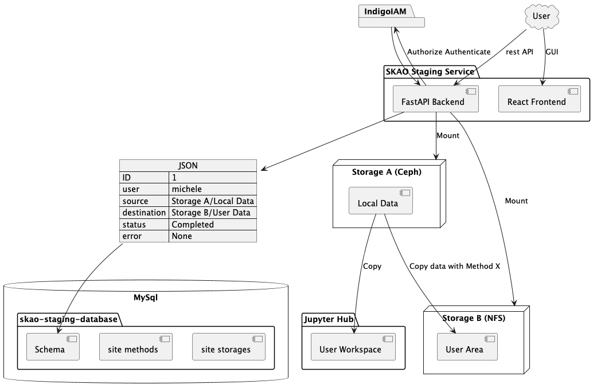
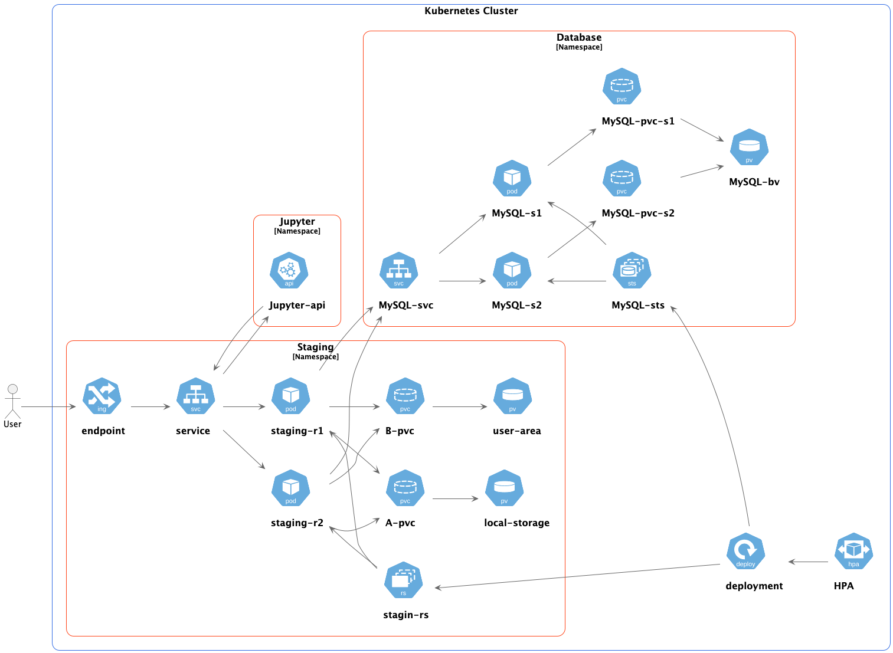
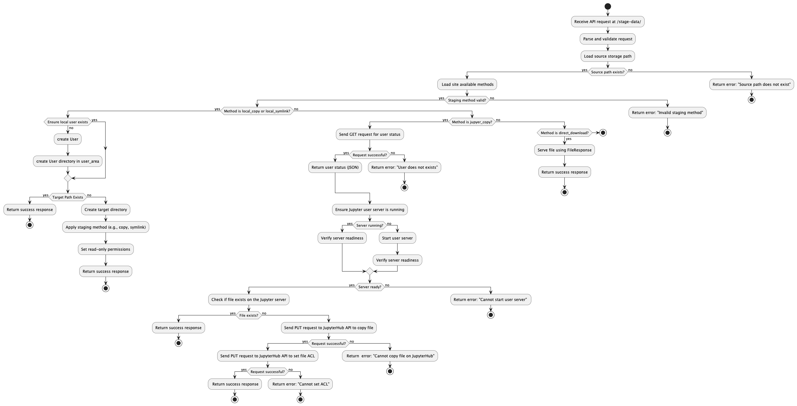

Skao Staging Service Documentation
==================================

*"To Boldly go where no staging service has gone before*

*MDV 20/01/25 - 2 AM "*

------

Welcome to the skao-staging-service documentation.
This service stages data for SKAO analysis.
The service code is distributed through GitHUb and available at the following
`Link <https://github.com/MicheleDelliVeneri/skao-staging-service>`_

Below are the main components and features of the repository:

- **FastAPI code**: Located in ``app/staging_service.py``
- **Tests**: Available in ``tests/test_staging_service.py``
- **Docker configuration**: Defined in ``Dockerfile``
- **Helm chart**: Found in ``charts/my-staging-service/``
- **React frontend**: Located in ``frontend/``
- **Sphinx docs**: In ``docs/``

The service is installed and configured with Helm and runs on a kubernates clusters.
The main objective of the service is to perform
data transfers between locally mounted storages or a mounted storage
and an user Jupyter server working directory.

Overview
--------

Helm Deployment Schema
**********

The service relies on some underlying assumptions:

1. There is a functioning Identity and Authentication Manager (IAM) which has authenticated the user
and given authorization to accecss / move the data
2. That the data has been moved to

API Schema
**********

Contents
--------

.. toctree::
   :maxdepth: 2
   :caption: Contents:

   modules

Indices and tables
==================

* :ref:`genindex`
* :ref:`modindex`
* :ref:`search`